<!-- Referencia:

```mermaid
classDiagram
	Kingdom <|-- Phylum
	Phylum <|-- Classe
	Classe <|-- Order
	Order <|-- Family
	Family <|-- Genus
	Genus <|-- Species
	Species <|-- Animal
	Animal *-- Localization
	Animal *-- Biologist
	
	class Kingdom {
		-String name
		-String description
		
		+Kingdom()
		+get_name() String
		+get_description() String
		+set_name(String name) bool
		+set_description(String description) bool
		}
	
	class Phylum {
		-String name
		-String distinctive_characteristics
		
		+Phylum()
		+get_name() String
		+get_distinctive_characteristics() String
		+set_name(String name) bool
		+set_distinctive_characteristics(String distinctive_characteristics) bool
		}
		
	class Classe {
		-String name
		-String description

		+Class()
		+get_name() : String
		+get_description() : String
		+set_name(String name) bool
		+set_description(String description) bool
		}
		
	class Order {
		-String name
		-String description

		+Order()
		+get_name() : String
		+get_description() : String
		+set_name(String name) bool
		+set_description(String description) bool
		}
	
	class Family {
		-String name
		-String description
		
		+Family()
		+get_name() String
		+get_description() String
		+set_name(String name) bool
		+set_description(String description) bool
		}
	
	class Genus {
		-String name
		-String aspects

		+Genus()
		+get_name() : String
		+get_aspects() : String
		+set_name(String name) : bool
		+set_aspects(String aspects) : bool
		}
		
	class Species {
		-String name
		-String abbreviations
		-String category
		
		+Species()
		+get_name() String
		+get_abbreviations() String
		+get_category() String
		+set_name(String name) bool
		+set_abbreviations(String abbreviations) bool
		+set_category(String category) bool
		}
		
	class Animal {
		-String name
		-String binomial_name
		-Vector~float~ height_and_weight
		-String descriptive_characteristics
		-float life_span
		-String extinction
		-Localization localization
		-Biologist biologist
		-bool is_active
		
		+Animal(String name)
		+get_name() String
		+get_binomial_name() String
		+get_height_and_weight() Vector
		+get_descriptive_characteristics() String
		+get_life_span() float
		+get_conservation_state() String
		+get_is_active() bool
		+set_name(String name) bool
		+set_binomial_name(String binomial_name) bool
		+set_height_and_weight(Vector~float~ height_and_weight) bool
		+set_descriptive_characteristics(String descriptive_characteristics) bool
		+set_life_span(int life_span) bool
		+set_conservation_state(String acronym) bool
		+set_is_active() void
		}
		
	class Localization {
		-String geographical_distribution
		-String habitat
		-String discovery_point
		-Vector~int~ discovery_date
		
		+Localization()
		+get_geographical_distribution() String
		+get_habitat() String
		+get_discovery_point() String
		+get_discovery_date() Vector~int~
		+set_geographical_distribution(String geographical_distribution) bool
		+set_habitat(String habitat) bool
		+set_discovery_point(String discovery_point) bool
		+set_discovery_date(Vector~int~ discovery_date) bool
		}

	class Biologist {
		-String name
		-Vector~int~ birth_data
		-String nationality
		-String gender
		
		+Biologist()
		+get_name() String
		+get_birth_data() Vector~int~
		+get_nationality() String
		+get_gender() String
		+set_name(String name) bool
		+set_birth_data(Vector~int~ birth_data) bool
		+set_nationality(String nationality) bool
		+set_gender(String gender) bool
		}
```

https://mermaid-js.github.io/mermaid/#/classDiagram?id=syntax

https://pt.wikipedia.org/wiki/Categoria:Fauna_da_Caatinga

https://www.infoescola.com/biomas/fauna-da-caatinga/#:~:text=Merecem%20destaque%20esp%C3%A9cies%20amea%C3%A7adas%20de
-->